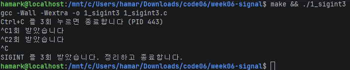
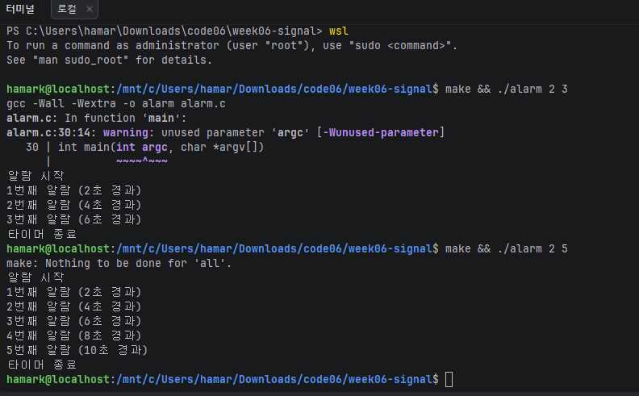
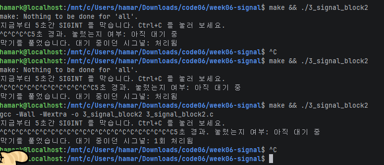

# 시스템프로그래밍 6주차 과제 — 시그널 처리

시그널 핸들러를 등록하고, 타이머를 만들고, 시그널을 잠깐 막아 본다.

| 파일 | 원본 | 내용 |
|---|---|---|
| `1_sigint3.c` | `original/1_sigint.c` | Ctrl+C 를 세 번 눌러야 종료 |
| `alarm.c` | `original/2_alarm.c` | `./alarm <간격초> <반복횟수>` 반복 타이머 |
| `3_signal_block2.c` | `original/3_signal_block.c` | SIGINT 를 5초 막았다 풀기 + 관찰 |

## 빌드 / 실행 (WSL2)

```bash
make
./1_sigint3            # Ctrl+C 세 번
./alarm 2 5            # 2초마다 5번
./3_signal_block2      # 5초 동안 Ctrl+C 여러 번
```

## 1. 1_sigint3 — Ctrl+C 세 번에 종료

(설명)



## 2. alarm — N초마다 M번 울리는 타이머

(설명)



## 3. 3_signal_block2 — 막았다 풀기

(설명 / 관찰 결과)



---

## AI 활용 내용

### 사용한 도구와 프롬프트

(Claude 사용. 어떤 프롬프트를 줬는지)

### AI 가 한 것

(개념 설명, 고칠 위치 안내, 오류 지적, README 구조, 환경 세팅 등)

### 내가 한 것 / 고친 것

| 과제 | 내가 바꾼 것 |
|---|---|
| 1_sigint3.c | |
| alarm.c | |
| 3_signal_block2.c | |

### 이해한 내용 (내 말로)

1. 핸들러 안에서 printf 를 쓰면 안 되는 이유:
2. volatile 과 sig_atomic_t 가 각각 하는 일:
3. alarm.c 에서 핸들러 안에서 alarm() 을 다시 부르는 이유:
4. 과제 1 에서 printf 를 pause() 다음 줄에 둔 이유:
5. 막힌 동안 누른 Ctrl+C 가 버려지지 않는 이유 / 여러 번 눌러도 한 번만 오는 이유:
