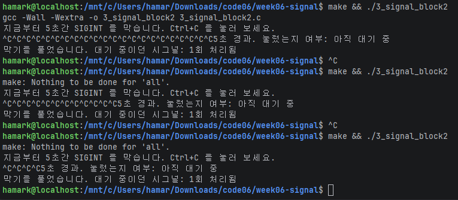

# 시스템프로그래밍 6주차 과제 — 시그널 처리

시그널 핸들러를 등록하고, 타이머를 만들고, 시그널을 잠깐 막아 본다.

| 파일 | 원본 | 내용 |
|---|---|---|
| `1_sigint3.c` | `original/1_sigint.c` | Ctrl+C 를 세 번 눌러야 종료 |
| `alarm.c` | `original/2_alarm.c` | `./alarm <간격초> <반복횟수>` 반복 타이머 |
| `3_signal_block2.c` | `original/3_signal_block.c` | SIGINT 를 5초 막았다 풀기 / 횟수 보이게 변경 |

## 빌드 / 실행 (WSL2)

```bash
make
./1_sigint3            # Ctrl+C 세 번
./alarm 2 5            # 2초마다 5번
./3_signal_block2      # 5초 동안 Ctrl+C 여러 번
```

## 1. 1_sigint3 — Ctrl+C 세 번에 종료


1번 과제 변경점
``` 1번 과제 / 변경점
1. got_sigint = 0 을 got_sigint_count = 0 으로 변수이름 변경
- 몇 번 왓는지 카운트 하기 위해 변수 이름 알아보기 쉽게 변경

2. 핸들러 got_sigint = 1; 을 got_sigint_count += 1; 로 변경
- 한번 올때마다 횟수를 새게 함

3. while (!got_sigint)     /     while (got_sigint_count < 3) {  
        pause();                     pause();                    
                                     if (got_sigint_count < 3)
                                         printf(...); //횟수출력
                                }
- 3이 될때까지 반복
- pause() 가 돌아온 직후에 횟수를 출력 하도록 함

4. printf("\nSIGINT 를 3회 받았습니다. 정리하고 종료합니다.\n"); 
- 종료 메시지에 몇 회 받았는지 횟수 출력 후 종료하게 함

```


## 2. alarm — N초마다 M번 울리는 타이머


2번 과제 변경점
``` 2번 과제 / 변경점
1. timeout 플래그를 timeout을 올리는 횟수 카운터로 변경
- timeout += 1;로 변경하여 알람이 몇 번 울렸는지 확인하도록 변경

2. 전역 변수 int count , int repeat 추가
- 간격과 횟수를 입력받아야 하는데 핸들러는 값을 받지 못하기 때문에 추가
- 핸들러가 읽어야 하는 값이기에 전역 변수로 함

3. 핸들러에서 timeout = 1;을 timeout += 1;로 변경
- 알람이 울릴 때마다 횟수가 하나씩 증가하도록 변경
- if (timeout < repeat) alarm(count); 를 넣어서 횟수보다 아래일때 다음 알람을 예약

4. main(void)를 main(int argc, char *argv[])로 변경
- atoi(argv[1]), atoi(argv[2]) 로 알람 간격과 반복 횟수를 입력받도록 변경

5. alarm(3)을 alarm(count)로 변경
- 첫 알람 (이후는 핸들러가 처리)

6. fgets() 입력 대기와 alarm(0) 취소 부분을 전부 삭제
- while (timeout < repeat) { pause(); printf(...)} 로 변경
- 입력 제한시간을 설정하는 프로그램이 아니기에 필요없음
```


## 3. 3_signal_block2 — 막았다 풀기

3번 과제 변경점
``` 3번과제 / 변경점
*** 3번 과제는 변형보다는 관찰이라는 느낌이라 처리된 횟수만 나오도록 변경해보았습니다***
1. 핸들러의 got = 1;을 got += 1;로 변경
- 횟수를 증가시키도록 변경하여 핸들러가 몇 번 실행되었는지 확인

2. 마지막 출력에 횟수가 안나오던 것을 "%d회 처리됨 or 없었음" 형식으로 변경
-  전달되었는 지 확인을 위해 처리된 횟수를 숫자로 출력하도록 변경

~ 관찰 결과
- 막힌 5초 동안 Ctrl+C 를 열번 정도 누름 그래도 프로그램이 끝나지 않고 "아직 대기 중"이었고, 
SIG_SETMASK 로 풀리자 마자 핸들러가 실행됐는데 1회만 실행됨

- 막힌 동안의 시그널은 버려지지 않고 대기하지만, 그것이 쌓이지는 않아서 몇 번을 눌러도 한 번만 전달된다는것을 알게됨.

```


---

## AI 활용 내용

### 사용한 도구와 프롬프트

(Claude 사용. 어떤 프롬프트를 줬는지)

### AI 가 한 것

(개념 설명, 고칠 위치 안내, 오류 지적, README 구조, 환경 세팅 등)

### 내가 한 것 / 고친 것

| 과제 | 내가 바꾼 것 |
|---|---|
| 1_sigint3.c | |
| alarm.c | |
| 3_signal_block2.c | |

### 이해한 내용 (내 말로)

1. 핸들러 안에서 printf 를 쓰면 안 되는 이유:
2. volatile 과 sig_atomic_t 가 각각 하는 일:
3. alarm.c 에서 핸들러 안에서 alarm() 을 다시 부르는 이유:
4. 과제 1 에서 printf 를 pause() 다음 줄에 둔 이유:
5. 막힌 동안 누른 Ctrl+C 가 버려지지 않는 이유 / 여러 번 눌러도 한 번만 오는 이유:
